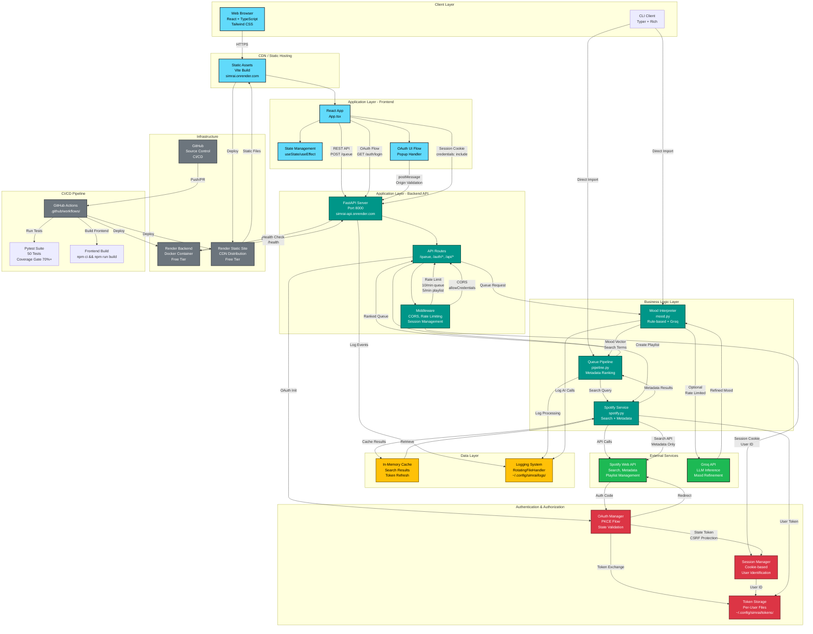
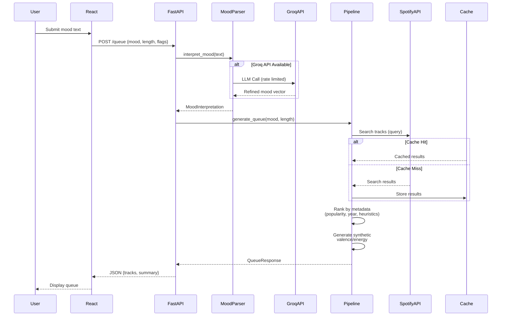
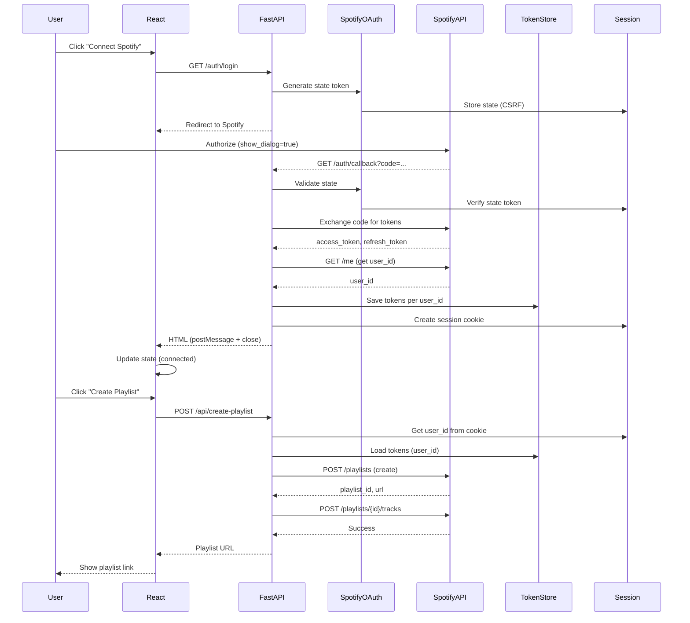
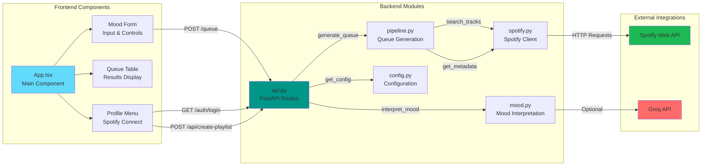
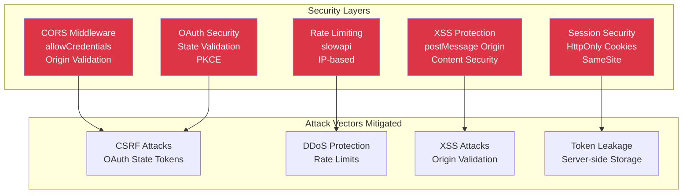
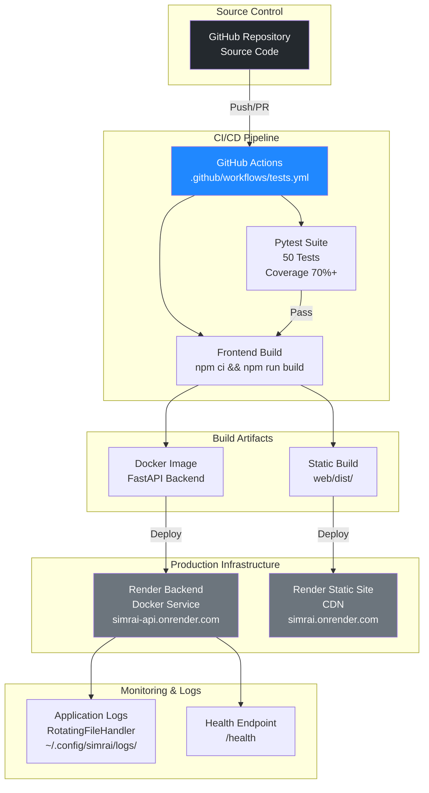

# SIMRAI System Architecture

## Production-Grade System Architecture Diagram

## Data Flow Diagrams

### Queue Generation Flow

### OAuth & Playlist Export Flow

## Component Interaction Diagram

## Security Architecture

## Deployment Architecture

## Technology Stack Summary

| Layer | Technology | Purpose |
|-------|------------|---------|
| **Frontend** | React 18+ | UI Framework |
| | TypeScript | Type Safety |
| | Vite | Build Tool |
| | Tailwind CSS | Styling |
| **Backend** | Python 3.10+ | Runtime |
| | FastAPI | Web Framework |
| | Typer | CLI Framework |
| | Rich | CLI UI |
| **AI/ML** | Groq API | LLM Inference |
| | LangChain | LLM Abstraction |
| **Music API** | Spotify Web API | Music Data |
| **Auth** | OAuth 2.0 + PKCE | Authentication |
| **Infrastructure** | Docker | Containerization |
| | Render | Hosting |
| | GitHub Actions | CI/CD |
| **Testing** | pytest | Test Framework |
| | pytest-cov | Coverage |
| | Cypress | E2E Tests |

