# SIMRAI System Architecture 🎵

## How SIMRAI Works - High-Level Overview

```mermaid
graph TB
    subgraph "👤 Client Layer"
        USER[User Input<br/>💭 Free-text mood description]
        WEB[🌐 Web Browser<br/>React 18 + TypeScript<br/>Vite + Tailwind CSS]
        CLI[💻 CLI Client<br/>Typer + Rich<br/>Python CLI]
    end

    subgraph "🌐 Frontend Application Layer"
        REACT[⚛️ React App<br/>App.tsx<br/>State: useState/useEffect]
        FORM[📝 Mood Form Component<br/>Input validation<br/>POST /queue]
        RESULTS[🎼 Queue Display<br/>Track table<br/>Valence/Energy bars]
        AUTH_UI[🔐 OAuth UI Handler<br/>Popup window<br/>postMessage listener]
    end

    subgraph "⚙️ Backend API Layer"
        API[🚀 FastAPI Server<br/>Port 8000<br/>Uvicorn ASGI]
        ROUTES[🛣️ API Routes<br/>POST /queue<br/>GET /auth/login<br/>POST /api/create-playlist]
        MIDDLEWARE[🛡️ Middleware Stack<br/>CORS allowCredentials<br/>Rate Limiting slowapi<br/>Session Cookie Handler]
    end

    subgraph "🧠 Business Logic Layer"
        MOOD[😊 Mood Interpreter<br/>mood.py<br/>Rule-based + Groq LLM<br/>MoodInterpretation]
        PIPELINE[🎵 Queue Pipeline<br/>pipeline.py<br/>Metadata ranking<br/>Synthetic valence/energy]
        SPOTIFY_SVC[🔍 Spotify Service<br/>spotify.py<br/>DirectSpotifyClient<br/>Search + Metadata only]
    end

    subgraph "🔒 Authentication & Authorization"
        OAUTH[🔐 OAuth Manager<br/>PKCE Flow<br/>State token validation<br/>CSRF protection]
        SESSION[🍪 Session Manager<br/>Cookie-based<br/>HttpOnly + SameSite<br/>User ID mapping]
        TOKEN_STORE[💾 Token Storage<br/>Per-user files<br/>~/.config/simrai/tokens/{user_id}/<br/>access_token.json]
    end

    subgraph "📊 Data & Caching Layer"
        CACHE[⚡ In-Memory Cache<br/>Search results<br/>TTL-based expiration<br/>Token refresh cache]
        LOGS[📝 Logging System<br/>RotatingFileHandler<br/>10MB rotation<br/>~/.config/simrai/logs/]
    end

    subgraph "☁️ External Services"
        SPOTIFY_API[🎵 Spotify Web API<br/>/v1/search<br/>/v1/artists<br/>/v1/playlists<br/>OAuth 2.0]
        GROQ_API[🤖 Groq API<br/>LLM Inference<br/>llama-3.1-8b-instant<br/>Rate limited]
    end

    subgraph "🌍 Infrastructure & Deployment"
        RENDER_BACKEND[☁️ Render Backend<br/>Docker Container<br/>Free Tier<br/>Auto-sleep]
        RENDER_FRONTEND[🌐 Render Static Site<br/>CDN Distribution<br/>Vite build output]
        GITHUB[📦 GitHub<br/>Source Control<br/>CI/CD Triggers]
    end

    %% User Flow
    USER -->|Type mood| WEB
    WEB --> REACT
    REACT --> FORM
    REACT --> RESULTS
    REACT --> AUTH_UI
    FORM -->|POST /queue<br/>JSON body| API
    AUTH_UI -->|GET /auth/login<br/>OAuth redirect| API
    
    %% API Processing
    API --> ROUTES
    ROUTES --> MIDDLEWARE
    MIDDLEWARE -->|Rate limit check<br/>10/min queue| ROUTES
    MIDDLEWARE -->|CORS headers<br/>allowCredentials| ROUTES
    MIDDLEWARE -->|Session cookie<br/>Extract user_id| SESSION
    
    %% Business Logic
    ROUTES -->|interpret_mood()| MOOD
    MOOD -->|Optional LLM call<br/>Rate limited| GROQ_API
    GROQ_API -->|Refined mood vector| MOOD
    MOOD -->|MoodInterpretation| PIPELINE
    PIPELINE -->|search_tracks()| SPOTIFY_SVC
    SPOTIFY_SVC -->|GET /v1/search<br/>q=query| SPOTIFY_API
    SPOTIFY_API -->|Track metadata| SPOTIFY_SVC
    SPOTIFY_SVC -->|Cached results| CACHE
    SPOTIFY_SVC -->|Ranked tracks| PIPELINE
    PIPELINE -->|QueueResponse| ROUTES
    
    %% OAuth Flow
    ROUTES -->|OAuth initiation| OAUTH
    OAUTH -->|Generate state token<br/>Store in session| SESSION
    OAUTH -->|Redirect to Spotify<br/>show_dialog=true| SPOTIFY_API
    SPOTIFY_API -->|Auth code callback| OAUTH
    OAUTH -->|Exchange code<br/>Get tokens| SPOTIFY_API
    OAUTH -->|Save per user_id| TOKEN_STORE
    SESSION -->|Map session_id| TOKEN_STORE
    
    %% Playlist Creation
    ROUTES -->|POST /api/create-playlist<br/>User token| SPOTIFY_SVC
    SPOTIFY_SVC -->|Load from TOKEN_STORE| TOKEN_STORE
    SPOTIFY_SVC -->|POST /v1/users/{id}/playlists| SPOTIFY_API
    
    %% Logging
    API -->|INFO/ERROR logs| LOGS
    PIPELINE -->|Processing logs| LOGS
    MOOD -->|AI call logs| LOGS
    
    %% Deployment
    API -->|Docker build| RENDER_BACKEND
    REACT -->|npm run build| RENDER_FRONTEND
    GITHUB -->|Push triggers| RENDER_BACKEND

    %% Colorful Styling
    classDef client fill:#FF6B9D,stroke:#C2185B,stroke-width:3px,color:#fff
    classDef frontend fill:#4ECDC4,stroke:#00695C,stroke-width:3px,color:#fff
    classDef backend fill:#FFE66D,stroke:#F57F17,stroke-width:3px,color:#000
    classDef logic fill:#A8E6CF,stroke:#2E7D32,stroke-width:3px,color:#000
    classDef security fill:#FFB74D,stroke:#E65100,stroke-width:3px,color:#000
    classDef data fill:#95E1D3,stroke:#00897B,stroke-width:3px,color:#000
    classDef external fill:#1DB954,stroke:#191414,stroke-width:3px,color:#fff
    classDef infra fill:#B39DDB,stroke:#4A148C,stroke-width:3px,color:#fff

    class USER,WEB,CLI client
    class REACT,FORM,RESULTS,AUTH_UI frontend
    class API,ROUTES,MIDDLEWARE backend
    class MOOD,PIPELINE,SPOTIFY_SVC logic
    class OAUTH,SESSION,TOKEN_STORE security
    class CACHE,LOGS data
    class SPOTIFY_API,GROQ_API external
    class RENDER_BACKEND,RENDER_FRONTEND,GITHUB infra
```

## Queue Generation Flow - Technical Sequence


## OAuth & Playlist Export Flow - Technical Sequence

```mermaid
sequenceDiagram
    participant User as 👤 User
    participant React as ⚛️ React App
    participant FastAPI as 🚀 FastAPI
    participant SpotifyOAuth as 🔐 OAuth Handler
    participant SpotifyAPI as 🎵 Spotify API
    participant TokenStore as 💾 Token Storage
    participant Session as 🍪 Session Manager

    User->>React: Click "Connect Spotify"
    React->>React: window.open()<br/>Popup: /auth/login
    React->>FastAPI: GET /auth/login<br/>No auth required
    FastAPI->>SpotifyOAuth: Generate OAuth state<br/>Random UUID + timestamp
    SpotifyOAuth->>Session: Store state token<br/>{state: uuid, expires: +10min}
    FastAPI->>FastAPI: Build auth URL:<br/>https://accounts.spotify.com/authorize<br/>?client_id=...<br/>&response_type=code<br/>&redirect_uri=...<br/>&scope=playlist-modify-private<br/>&show_dialog=true<br/>&state={state}
    FastAPI-->>React: HTTP 302 Redirect<br/>Location: Spotify auth URL
    
    User->>SpotifyAPI: Authorize app<br/>(show_dialog=true shows permissions)
    SpotifyAPI->>User: Display consent screen<br/>"Allow SIMRAI to create playlists?"
    User->>SpotifyAPI: ✅ Grant permission
    SpotifyAPI-->>FastAPI: GET /auth/callback<br/>?code={auth_code}&state={state}
    
    FastAPI->>SpotifyOAuth: Validate state token<br/>Check session store
    SpotifyOAuth->>Session: Verify state exists<br/>& not expired
    Session-->>SpotifyOAuth: State valid ✅
    
    FastAPI->>SpotifyAPI: POST https://accounts.spotify.com/api/token<br/>grant_type=authorization_code<br/>&code={auth_code}<br/>&redirect_uri=...
    SpotifyAPI-->>FastAPI: {access_token, refresh_token,<br/>expires_in: 3600}
    FastAPI->>SpotifyAPI: GET /v1/me<br/>Authorization: Bearer {access_token}
    SpotifyAPI-->>FastAPI: {id: "user_123", display_name: "..."}
    
    FastAPI->>TokenStore: Save tokens<br/>Path: ~/.config/simrai/tokens/user_123/<br/>File: access_token.json<br/>{access_token, refresh_token, expires_at}
    FastAPI->>Session: Create session cookie<br/>Set-Cookie: simrai_session={session_id}<br/>HttpOnly, SameSite=Lax
    FastAPI->>Session: Map session_id → user_id<br/>{session_id: "abc", user_id: "user_123"}
    FastAPI-->>React: HTMLResponse<br/>postMessage({type: "simrai-spotify-connected"})<br/>window.close()
    React->>React: message listener<br/>event.origin validation
    React->>React: setSpotifyConnected(true)<br/>fetchSpotifyUser()
    React-->>User: "Spotify connected ✅"
    
    Note over User,SpotifyAPI: Playlist Creation Flow
    
    User->>React: Click "Create Playlist"
    React->>FastAPI: POST /api/create-playlist<br/>Cookie: simrai_session={session_id}<br/>Body: {name, description, public: false}
    FastAPI->>Session: Extract user_id<br/>from session cookie
    Session-->>FastAPI: user_id: "user_123"
    FastAPI->>TokenStore: Load tokens<br/>Path: tokens/user_123/access_token.json
    TokenStore-->>FastAPI: {access_token, refresh_token}
    
    alt Token Expired
        FastAPI->>SpotifyAPI: POST /api/token<br/>grant_type=refresh_token<br/>&refresh_token=...
        SpotifyAPI-->>FastAPI: New access_token
        FastAPI->>TokenStore: Update access_token
    end
    
    FastAPI->>SpotifyAPI: POST /v1/users/user_123/playlists<br/>Authorization: Bearer {access_token}<br/>Body: {name, description, public}
    SpotifyAPI-->>FastAPI: {id: "playlist_456",<br/>external_urls: {spotify: "..."}}
    
    FastAPI->>SpotifyAPI: POST /v1/playlists/playlist_456/tracks<br/>?uris=spotify:track:abc,spotify:track:def,...
    SpotifyAPI-->>FastAPI: {snapshot_id: "..."}
    FastAPI-->>React: HTTP 200<br/>{playlist_id, url}
    React-->>User: Display playlist link<br/>"Open in Spotify ↗"
```



## Component Architecture - Detailed View

```mermaid
graph LR
    subgraph "🌐 Frontend Components (React + TypeScript)"
        A[App.tsx<br/>Main Component<br/>State Management]
        B[Mood Form<br/>TextArea + Sliders<br/>Form Validation]
        C[Queue Table<br/>Track Display<br/>Valence/Energy Bars]
        D[Profile Menu<br/>Spotify Connect UI<br/>User Avatar]
    end

    subgraph "⚙️ Backend Modules (Python)"
        E[api.py<br/>FastAPI Routes<br/>@app.post, @app.get]
        F[mood.py<br/>MoodInterpreter<br/>interpret_mood()]
        G[pipeline.py<br/>QueueGenerator<br/>generate_queue()]
        H[spotify.py<br/>DirectSpotifyClient<br/>search_tracks()]
        I[config.py<br/>Configuration<br/>get_config(), env vars]
    end

    subgraph "🔒 Security Layer"
        J[OAuth Handler<br/>PKCE Flow<br/>State Validation]
        K[Session Manager<br/>Cookie-based<br/>User ID mapping]
        L[Token Storage<br/>File-based<br/>Per-user isolation]
    end

    subgraph "☁️ External APIs"
        M[Spotify Web API<br/>REST Endpoints<br/>OAuth 2.0]
        N[Groq API<br/>LLM Inference<br/>Chat Completions]
    end

    A --> B
    A --> C
    A --> D
    B -->|POST /queue| E
    D -->|GET /auth/login| E
    D -->|POST /api/create-playlist| E
    
    E -->|import| F
    E -->|import| G
    F -->|Optional| N
    G -->|import| H
    H -->|httpx.get| M
    E -->|import| I
    E -->|import| J
    J -->|import| K
    J -->|import| L

    style A fill:#4ECDC4,stroke:#00695C,stroke-width:3px,color:#fff
    style E fill:#FFE66D,stroke:#F57F17,stroke-width:3px,color:#000
    style F fill:#A8E6CF,stroke:#2E7D32,stroke-width:3px,color:#000
    style G fill:#A8E6CF,stroke:#2E7D32,stroke-width:3px,color:#000
    style H fill:#A8E6CF,stroke:#2E7D32,stroke-width:3px,color:#000
    style M fill:#1DB954,stroke:#191414,stroke-width:3px,color:#fff
    style N fill:#FF6B9D,stroke:#C2185B,stroke-width:3px,color:#fff
    style J fill:#FFB74D,stroke:#E65100,stroke-width:3px,color:#000
    style K fill:#FFB74D,stroke:#E65100,stroke-width:3px,color:#000
    style L fill:#FFB74D,stroke:#E65100,stroke-width:3px,color:#000
```

## Security Architecture - Production Implementation

```mermaid
graph TB
    subgraph "🛡️ Security Layers"
        CORS[CORS Middleware<br/>allow_origins: localhost, simrai.onrender.com<br/>allow_credentials: True<br/>allow_methods: GET, POST]
        RATE[Rate Limiting<br/>slowapi Limiter<br/>Key: get_remote_address<br/>10/min: /queue<br/>5/min: /api/create-playlist]
        OAUTH_SEC[OAuth Security<br/>State token: UUID + timestamp<br/>CSRF protection<br/>PKCE flow]
        SESSION_SEC[Session Security<br/>HttpOnly cookies<br/>SameSite=Lax<br/>Secure in production]
        XSS[XSS Protection<br/>postMessage origin validation<br/>event.origin === API_BASE<br/>Content Security Policy]
        TOKEN_SEC[Token Security<br/>Server-side storage only<br/>Per-user file isolation<br/>No client exposure]
    end

    subgraph "🔐 Attack Mitigations"
        CSRF[CSRF Attacks<br/>✅ OAuth state tokens<br/>✅ Session validation]
        DOS[DDoS Protection<br/>✅ IP-based rate limits<br/>✅ Request throttling]
        XSS_ATTACK[XSS Attacks<br/>✅ Origin validation<br/>✅ postMessage checks]
        TOKEN_LEAK[Token Leakage<br/>✅ Server-side only<br/>✅ HttpOnly cookies]
        SESSION_HIJACK[Session Hijacking<br/>✅ Secure cookies<br/>✅ User ID mapping]
    end

    CORS --> CSRF
    RATE --> DOS
    OAUTH_SEC --> CSRF
    SESSION_SEC --> SESSION_HIJACK
    XSS --> XSS_ATTACK
    TOKEN_SEC --> TOKEN_LEAK

    style CORS fill:#FF6B9D,stroke:#C2185B,stroke-width:3px,color:#fff
    style RATE fill:#FFE66D,stroke:#F57F17,stroke-width:3px,color:#000
    style OAUTH_SEC fill:#4ECDC4,stroke:#00695C,stroke-width:3px,color:#fff
    style SESSION_SEC fill:#A8E6CF,stroke:#2E7D32,stroke-width:3px,color:#000
    style XSS fill:#FFB74D,stroke:#E65100,stroke-width:3px,color:#000
    style TOKEN_SEC fill:#95E1D3,stroke:#00897B,stroke-width:3px,color:#000
```



## Deployment Architecture - CI/CD Pipeline

```mermaid
graph TB
    subgraph "📦 Source Control"
        GIT[GitHub Repository<br/>Source Code<br/>Main Branch]
    end

    subgraph "🔄 CI/CD Pipeline"
        ACTIONS[GitHub Actions<br/>.github/workflows/tests.yml<br/>Triggers: push, PR]
        PYTEST[Pytest Suite<br/>50 Tests<br/>Coverage: 70%+ gate<br/>--cov-fail-under=70]
        BUILD[Frontend Build<br/>npm ci<br/>npm run build<br/>Vite production build]
    end

    subgraph "🐳 Build Artifacts"
        DOCKER[Docker Image<br/>python:3.11-slim<br/>FastAPI + dependencies<br/>Port 8000]
        STATIC[Static Build<br/>web/dist/<br/>Vite output<br/>HTML + JS + CSS]
    end

    subgraph "☁️ Production Infrastructure"
        RENDER_API[Render Backend<br/>Docker Service<br/>simrai-api.onrender.com<br/>Free Tier (auto-sleep)]
        RENDER_WEB[Render Static Site<br/>CDN Distribution<br/>simrai.onrender.com<br/>Static hosting]
    end

    subgraph "📊 Monitoring"
        LOGS[Application Logs<br/>RotatingFileHandler<br/>10MB rotation<br/>~/.config/simrai/logs/]
        HEALTH[Health Endpoint<br/>GET /health<br/>200 OK check]
    end

    GIT -->|Push/PR| ACTIONS
    ACTIONS --> PYTEST
    ACTIONS --> BUILD
    PYTEST -->|Pass| BUILD
    BUILD -->|docker build| DOCKER
    BUILD -->|npm run build| STATIC
    DOCKER -->|Deploy| RENDER_API
    STATIC -->|Deploy| RENDER_WEB
    RENDER_API -->|Write logs| LOGS
    RENDER_API -->|Health check| HEALTH

    style GIT fill:#24292e,stroke:#000,stroke-width:3px,color:#fff
    style ACTIONS fill:#2088ff,stroke:#0066cc,stroke-width:3px,color:#fff
    style PYTEST fill:#0C4A6E,stroke:#075985,stroke-width:3px,color:#fff
    style BUILD fill:#F59E0B,stroke:#D97706,stroke-width:3px,color:#fff
    style DOCKER fill:#2496ED,stroke:#0D7AB8,stroke-width:3px,color:#fff
    style STATIC fill:#646CFF,stroke:#4F56E8,stroke-width:3px,color:#fff
    style RENDER_API fill:#6c757d,stroke:#343a40,stroke-width:3px,color:#fff
    style RENDER_WEB fill:#6c757d,stroke:#343a40,stroke-width:3px,color:#fff
```

## Data Flow - Technical Pipeline

```mermaid
flowchart LR
    START([👤 User Input<br/>mood: string<br/>length: int<br/>flags: bool]) --> VALIDATE[📝 Input Validation<br/>FastAPI Pydantic<br/>QueueRequest model]
    VALIDATE --> RATE_CHECK{⏱️ Rate Limit<br/>10/min per IP<br/>slowapi check}
    RATE_CHECK -->|Exceeded| ERROR[❌ HTTP 429<br/>Too Many Requests]
    RATE_CHECK -->|OK| MOOD_PARSE[😊 Mood Parsing<br/>mood.py<br/>interpret_mood()]
    
    MOOD_PARSE --> AI_CHECK{🤖 Groq Available?<br/>GROQ_API_KEY set<br/>Rate limit OK?}
    AI_CHECK -->|Yes| GROQ_CALL[🤖 Groq LLM Call<br/>POST /v1/chat/completions<br/>Model: llama-3.1-8b-instant]
    AI_CHECK -->|No| RULE_BASED[📋 Rule-based<br/>Keyword matching<br/>Default heuristics]
    GROQ_CALL --> MERGE[🔀 Merge AI + Rules<br/>Combine suggestions]
    MERGE --> SEARCH
    RULE_BASED --> SEARCH[🔍 Spotify Search<br/>GET /v1/search<br/>q={query}<br/>type=track]
    
    SEARCH --> CACHE_CHECK{⚡ Cache Hit?<br/>Query in cache<br/>TTL valid?}
    CACHE_CHECK -->|Yes| CACHED[📦 Use Cache<br/>Return cached results]
    CACHE_CHECK -->|No| SPOTIFY_API[🎵 Spotify API<br/>HTTP Request<br/>Client credentials]
    SPOTIFY_API --> STORE_CACHE[💾 Store in Cache<br/>TTL: 5 minutes]
    STORE_CACHE --> RANK
    CACHED --> RANK[⭐ Metadata Ranking<br/>Popularity score<br/>Release year<br/>Text heuristics]
    
    RANK --> SYNTHESIZE[🎨 Synthesize Metrics<br/>Per-track valence/energy<br/>Metadata-based]
    SYNTHESIZE --> SORT[📊 Energy Progression<br/>Sort by energy<br/>Smooth curve]
    SORT --> BUILD[🎵 Build Queue<br/>QueueResponse<br/>{tracks, summary}]
    BUILD --> RESPONSE[✅ HTTP 200<br/>JSON Response]
    RESPONSE --> RENDER([🎼 Render UI<br/>Track table<br/>Valence/Energy bars])
    
    style START fill:#FF6B9D,stroke:#C2185B,stroke-width:3px,color:#fff
    style VALIDATE fill:#4ECDC4,stroke:#00695C,stroke-width:3px,color:#fff
    style RATE_CHECK fill:#FFE66D,stroke:#F57F17,stroke-width:3px,color:#000
    style MOOD_PARSE fill:#A8E6CF,stroke:#2E7D32,stroke-width:3px,color:#000
    style GROQ_CALL fill:#FF6B9D,stroke:#C2185B,stroke-width:3px,color:#fff
    style SEARCH fill:#1DB954,stroke:#191414,stroke-width:3px,color:#fff
    style RANK fill:#FFB74D,stroke:#E65100,stroke-width:3px,color:#000
    style BUILD fill:#95E1D3,stroke:#00897B,stroke-width:3px,color:#000
    style RESPONSE fill:#4ECDC4,stroke:#00695C,stroke-width:3px,color:#fff
    style RENDER fill:#FF6B9D,stroke:#C2185B,stroke-width:3px,color:#fff
```

## Technology Stack - Production Details

| Layer | Technology | Version | Purpose | Key Features |
|-------|------------|---------|---------|--------------|
| **🌐 Frontend** | React | 18+ | UI Framework | Hooks, TypeScript, Vite |
| | TypeScript | 5+ | Type Safety | Compile-time checks |
| | Vite | 5+ | Build Tool | Fast HMR, production builds |
| | Tailwind CSS | 3+ | Styling | Utility-first, custom palette |
| **⚙️ Backend** | Python | 3.10+ | Runtime | Async support, type hints |
| | FastAPI | 0.104+ | Web Framework | Async, OpenAPI, Pydantic |
| | Uvicorn | 0.24+ | ASGI Server | Production server |
| | Typer | 0.9+ | CLI Framework | Type-safe CLI |
| | Rich | 13+ | CLI UI | Beautiful terminal output |
| **🤖 AI/ML** | Groq API | Latest | LLM Inference | Fast inference, OSS models |
| | langchain-groq | Latest | LLM Wrapper | LangChain integration |
| **🎵 Music API** | Spotify Web API | v1 | Music Data | Search, metadata, playlists |
| | httpx | 0.25+ | HTTP Client | Async requests |
| **🔒 Auth** | OAuth 2.0 | RFC 6749 | Authentication | Standard OAuth flow |
| | PKCE | RFC 7636 | Security | Code challenge/verification |
| **🛡️ Security** | slowapi | 0.1.9+ | Rate Limiting | IP-based limits |
| | python-dotenv | 1.0+ | Config | Environment variables |
| **🐳 Infrastructure** | Docker | Latest | Containerization | Portable deployment |
| | Render | Free Tier | Hosting | Auto-sleep, CDN |
| **🔄 CI/CD** | GitHub Actions | Latest | Automation | Test, build, deploy |
| **🧪 Testing** | pytest | 7+ | Test Framework | Fixtures, parametrization |
| | pytest-cov | 4+ | Coverage | Coverage reports |
| | Cypress | 13+ | E2E Tests | Browser testing |

## API Endpoints - Technical Reference

| Method | Endpoint | Auth | Rate Limit | Description |
|--------|----------|------|------------|-------------|
| `POST` | `/queue` | None | 10/min | Generate music queue from mood |
| `GET` | `/health` | None | None | Health check endpoint |
| `GET` | `/auth/login` | None | None | Initiate Spotify OAuth flow |
| `GET` | `/auth/callback` | None | None | OAuth callback handler |
| `POST` | `/api/create-playlist` | Session | 5/min | Create Spotify playlist |
| `POST` | `/api/add-tracks` | Session | 10/min | Add tracks to playlist |
| `GET` | `/api/me` | Session | None | Get Spotify user profile |
| `POST` | `/api/unlink-spotify` | Session | None | Revoke Spotify connection |

## Performance Considerations ⚡

- **Caching**: In-memory cache for Spotify search results (5min TTL)
- **Async Operations**: FastAPI async endpoints for concurrent requests
- **Rate Limiting**: Prevents API exhaustion and DDoS
- **Metadata-Only**: No heavy audio analysis (faster responses)
- **Token Refresh**: Automatic token refresh before expiration
- **Cold Start**: Render free tier ~20-60s wake-up time (documented in UI)

## Error Handling 🛠️

- **Graceful Degradation**: Falls back to rule-based if Groq unavailable
- **HTTP Status Codes**: Proper 200, 400, 401, 429, 500 responses
- **Error Messages**: User-friendly error messages in API responses
- **Logging**: Comprehensive logging for debugging (INFO, WARNING, ERROR)
- **Validation**: Pydantic models validate all inputs

---

**Made with ❤️ by Ajay A**
